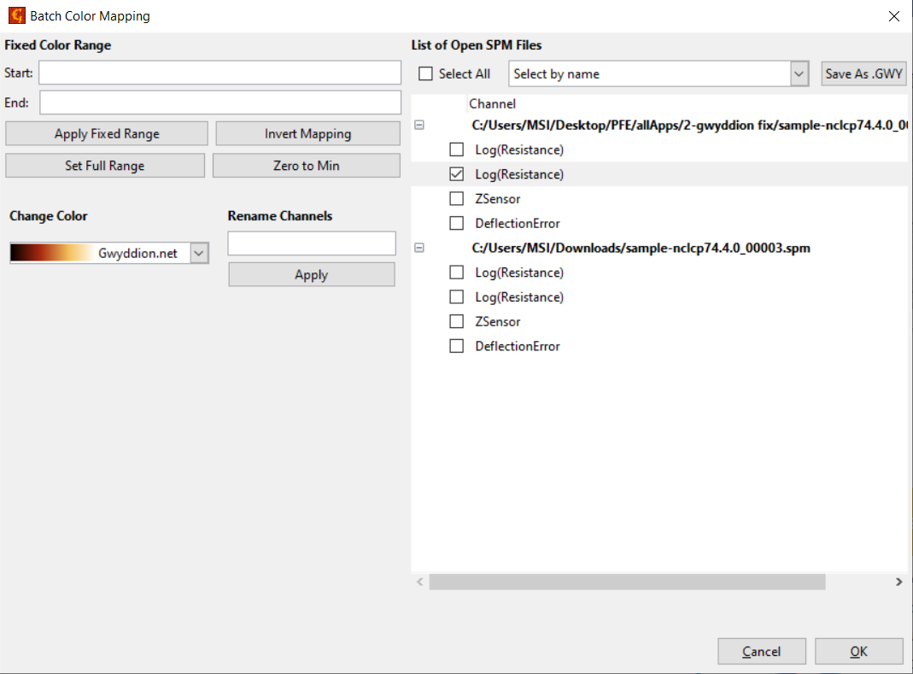
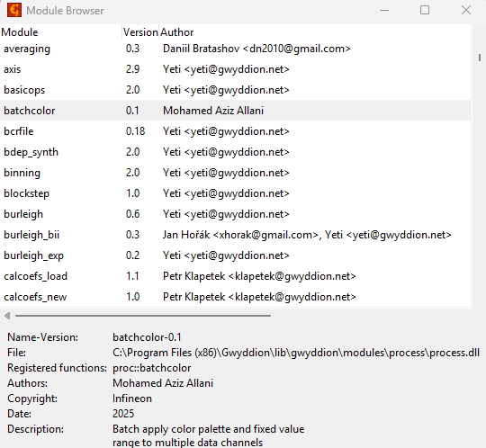

# Gwyddion C Module

A custom module developed in C for the Gwyddion scientific analysis platform and integrated into the official Gwyddion 2.71 release.

## Overview

This project extends Gwyddion by adding new functionality for the analysis and processing of Scanning Probe Microscopy (SPM) data. The module was developed using Gwyddion's native C API and follows the project's integration standards.

Functionally, it behaves similarly to a Python plugin but without macro automation support. It enables efficient batch processing of multiple SPM files at once.
The module includes features such as:
- Batch processing of multiple SPM files simultaneously  
- Color map customization for improved visualization  
- Fixed range scaling for consistent comparison between images  
- Inverted color mapping  
- Full-range normalization  
- Zero-to-min normalization  
- Batch renaming of multiple channels  

The implementation has been accepted into the official Gwyddion source code and is available starting from **Gwyddion 2.71**.

